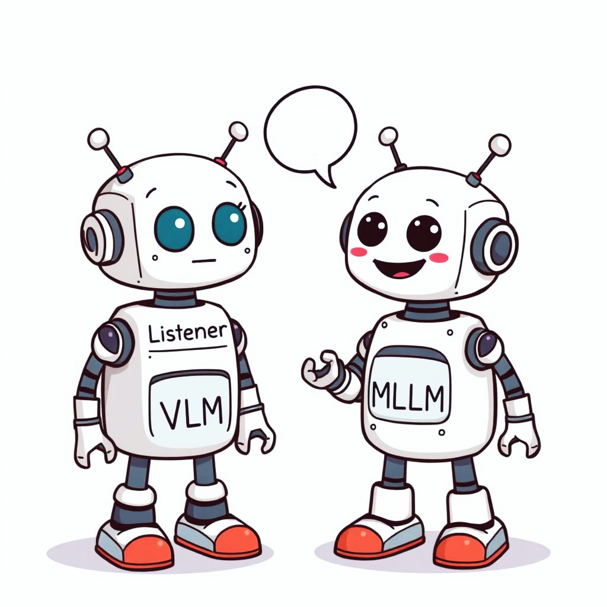

# Detect, Describe, Discriminate: Moving Beyond VQA for MLLM Evaluation

[Manu Gaur](https://manugaurdl.github.io/), [Darshan Singh S](https://darshansingh11.github.io/), [Makarand Tapaswi](https://makarandtapaswi.github.io/)

<p align="center">
  
</p>

<p float="left">
  <a href="https://arxiv.org/abs/2409.15125">
    
  </a>
  <a href="https://katha-ai.github.io/projects/detect-describe-discriminate/">
    
  </a>
</p>


## Welcome to Detect-Describe-Discriminate, this repository contains data and code for self-retrieval evaluation on D<sub>3</sub> benchmark.

### :zap:	For instant visualization of data samples, please visit our [Project Page](https://katha-ai.github.io/projects/detect-describe-discriminate/)

### Setting-up Data 💿

- The data is available [Here](https://drive.google.com/file/d/1X-8ARlBbj-U_uMEQ-PfPN1tOQqU1hKox/view?usp=sharing) as a `.zip` file.
- Either manually visit the link and donwload the `dataset.zip` in the root of this directory, or
- Download the `dataset.zip` via `gdown`

```
pip install gdown
cd detect-describe-discriminate
```
Then in a python terminal or a file,

```
import gdown
gdown 1yvA27H6UwG9eqA8tXmFibKJSfwbZMOZ_
```
Unzip the contents of `dataset.zip`, and ensure the following directory structure

```
├── images
│   ├── image1.jpg
│   ├── image2.jpg
│   ├── image3.jpg
│   ├── ...
│   └── image494.jpg
└── dataset.json
```

## Dataset Structure

`dataset.json` contains **247 image pairs** in a dictionary format where:

- **Keys**: Unique identifier (UID) for each image pair.
- **Values**: A dictionary containing the paths to the left and right images.

An example of an instance in `dataset.json`:

```json
{
  "0": {
    "left": "./images/COCO_val2014_000000471601.jpg",
    "right": "./images/COCO_val2014_000000556966.jpg"
  }
}
```

All the image pairs can be visualized using [visualize_benchmark.ipynb](visualize_benchmark.ipynb) !


## Structuring MLLM predictions

- To get MLLM captions on the D<sub>3</sub> benchmark, for each image pair in `dataset.json` prompt the MLLM with both images simultaneously, along with the following prompt: 

```plaintext
Identify finegrained visual differences between both images and use them to generate a discriminant caption for each image. Each caption should uniquely describe the image and highlight the distinct features that set the image apart from the other. Output JSON format with 'left_image' and 'right_image' as keys, and their captions as string values.
```

- Structure the output predictions in the same format `dataset.json` and store it as  `./captions/mllm_preds.json`. An example of an instance in `./captions/mllm_preds.json`:
```json
{
  "0": {
    "left": "The dog is facing left.",
    "right": "The dog is facing right."
  }
}
```


## Self-Retrieval Evaluation


To evaluate on the D<sub>3</sub> benchmark, run 
```
python evaluate.py FILENAME_OF_MLLM_PREDS_DICT
```
The script conducts self-retreival evaluation using captions stored in `./captions/mllm_preds.json` and stores an pickled dictionary containing recall scores for each image pair in `./uid2acc/`. The script currently uses `google/siglip-so400m-patch14-384` as a scorer.


## BibTeX
If you find our work useful, please cite as below

```
@article{gaur2024detect,
  title={Detect, Describe, Discriminate: Moving Beyond VQA for MLLM Evaluation},
  author={Gaur, Manu and Singh s, Darshan and Tapaswi, Makarand.},
  journal={arXiv preprint arXiv:2409.15125},
  year={2024}
}
```


[![CC BY-NC-SA 4.0][cc-by-nc-sa-shield]][cc-by-nc-sa]

This work is licensed under a
[Creative Commons Attribution-NonCommercial-ShareAlike 4.0 International License][cc-by-nc-sa].

[![CC BY-NC-SA 4.0][cc-by-nc-sa-image]][cc-by-nc-sa]

[cc-by-nc-sa]: http://creativecommons.org/licenses/by-nc-sa/4.0/
[cc-by-nc-sa-image]: https://licensebuttons.net/l/by-nc-sa/4.0/88x31.png
[cc-by-nc-sa-shield]: https://img.shields.io/badge/License-CC%20BY--NC--SA%204.0-lightgrey.svg

